
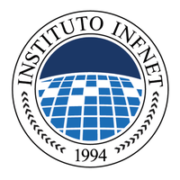

---

<h2 align="center"> INSTITUTO INFNET  
ESCOLA SUPERIOR DA TECNOLOGIA DA INFORMAÇÃO 
CURSO DE ENGENHARIA DE SOFTWARES</h2>

 

 

 

<h4 align="center" padding-top="200">Francisco Alves Camello Neto</h4>

 

 

 

<h3 align="center"> Assesment</h3>
<h3 align="center"> Arquitetura de Redes de Computadores</h3>

 

 

 

<h4 align="center">Profº Adriano Saad</h4>

 

 

---

Brasília  05 de abril de 2021

  

 

 

 

#### 01. Qual tipo de utilização faz o maior uso de tráfego na internet na sua opinião? Justifique sua resposta.

Em minha opinião, o maior uso de tráfego na internet vem das plataformas de streaming, seja de vídeos, ou de games, atualmente estão desenvolvendo tecnologias como o google stadia que será um streaming para que uma pessoa, que não possui um hardware potente, utilize uma máquina do google para jogar, de sua casa. Portanto, em minha visão o streaming é, e ainda tem potencial para ser ainda mais, a plataforma que mais utiliza o tráfego na internet.

#### 02. Os sistemas telefônicos utilizam o conceito de comutação de circuitos, já os sistemas computacionais utilizam comutação de pacotes. Explique a diferença entre os dois conceitos.

A comutação de circuito é usada no tráfego de voz, ela é a base para o sistema telefônico tradicional, o circuito estabelecido ficava reservado durante toda a duração da conversação. A comutação de pacotes é usada para o tráfego de dados, sendo por sua vez, a base para a Internet e para a Voz sobre IP.

ITEM | COMUTAÇÃO DE CIRCUITOS | COMUTAÇÃO DE PACOTES
-----|------------------------|---------------------
Configuração de chamadas | Obrigatória | Não necessária
Caminho físico dedicado | Sim | Não
Pacotes seguem o mesmo caminho | Sim | Não
Pacotes chegam na mesma ordem | Sim | Não
Reserva da largura de banda | Fixa | Dinâmica
Largura de banda desperdiçada | Sim | Não
A falha de um equipamento é fatal | Sim | Não

fonte: [https://www.teleco.com.br/tutoriais/tutorialvoipconv/pagina_3.asp](https://www.teleco.com.br/tutoriais/tutorialvoipconv/pagina_3.asp)

#### 03. Quando o assunto é classificação das redes quanto a Cobertura Geográfica, cite 3 itens que diferenciam redes LAN e PAN.

LAN - Local Area Network: Conectam computadores presentes dentro de um espaço curto, podendo ser uma residência, uma empresa ou uma escola. PAN - Personal Area Network: Usada para que dispositivos se comuniquem em uma area muito limitada. Um exemplo disso são dispositivos Bluetooth. A diferença principal é que o objetivo da rede PAN é conectar dispositivos próximos para que eles façam uma simples troca de informações, ou conectar dispositivos como mouses, teclados e fones a computadores e smartphones, já a rede LAN tem por objetivo fazer a conexão de inúmeros dispositivos dentro da rede para se comunicarem, trocarem informações de forma constante e os conectarem a internet. primeiro temos uma conexão a internet, maior distância, no geral, de conexão, maior constância para e quantidade de dispositivos, no geral, na conexão LAN em relação a conexão PAN.

#### 04. Qual a diferença entre switch e roteador? Os dois tem a mesma função? Explique detalhadamente.

Um Switch serve como controlador, permitindo que os dispositivos conectados a ele possam conversar entre si de forma eficiente, switches facilitam o compartilhamento de recursos, conectando todos os dispositivos, inclusive computadores, impressoras e servidores, na rede de uma empresa de pequeno porte. Graças ao switch, esses dispositivos conectados podem compartilhar informações e conversar entre si, independentemente de onde estejam, seja em um prédio ou no campus. Não é possível construir uma rede de empresa de pequeno porte sem os switches para unir os dispositivos. Assim como um switch, o roteador conecta vários dispositivos para criar uma rede. Além disso, um roteador conecta vários switches e suas respectivas redes para formar uma rede ainda maior, o roteador também permite que os dispositivos em rede e os vários usuários acessem a Internet. Por fim, um roteador funciona como um distribuidor, direcionando o  tráfego e escolhendo a rota mais eficiente para obter informações na forma de pacotes de dados e viajar pela rede. Um roteador conecta sua empresa ao mundo, protege as informações contra ameaças à segurança e decide quais dispositivos têm prioridade sobre os outros, como o próprio nome indica ele roteia, seleciona a melhor rota para os pacotes.

fonte: [https://www.cisco.com/c/pt_br/solutions/small-business/resource-center/networking/network-switch-vs-router.html](https://www.cisco.com/c/pt_br/solutions/small-business/resource-center/networking/network-switch-vs-router.html)

#### 05. O equipamento doméstico que fornece acesso a internet, que tem portas para rede cabeada e também para wifi é um roteador? Um modem? Ou um ponto de acesso? Justifique sua resposta.

O roteador, pois de certa forma ele faz a distribuição do acesso a internet nos dispositivos da casa, o roteador é responsável por fazer rotas, vai receber os pacotes e encaminhá-los ao seu destino, escolhendo a melhor rota possível na rede, distribui a internet para um ou mais dispositivos, seja via cabo de rede, ou pela rede Wi-Fi.

#### 06. Além da quantidade de camadas, o que diferencia o modelo OSI do modelo TCP/IP?

Os modelos trabalham em com modelos de camadas, tratam de protocolos independentes, porém são diferentes. O modelo OSI possui 7 camadas, o TCP/IP apenas 4, o TCP/IP mescla as camadas 1 e 2 do modelo OSI como camada de aplicação. A camada de Redes do OSI é chamada de Internet no TCP/IP. Os modelos foram desenvolvidos com objetivo de padronização das redes. O modelo OSI, modelo de referência da ISO, se tornou um modelo que seria base para garantir compatibilidade, interoperabilidade, portabilidade e escalabilidade. O modelo OSI não é uma arquitetura de redes, pois não especifica os serviços e protocolos exatos que devem ser usados em cada camada. Ele apenas informa o que cada camada deve fazer.

#### 07. Altere a velocidade da placa de rede do seu computador. O exemplo está no material de aula, na Etapa 2 – Alteração da velocidade da placa de rede. Siga o passo do passo do material e mostre uma captura de tela com a alteração. Observação: a captura da tela deve capturar a tela toda, inclusive com o horário e data na barra inferior para garantir a autenticidade da captura. Dica: Você precisa ser administrador do Windows para fazer essa alteração.

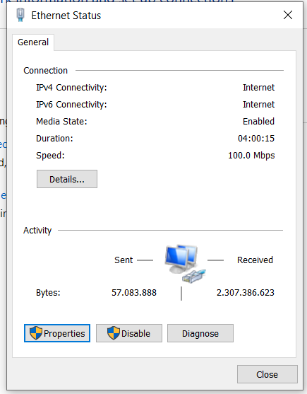

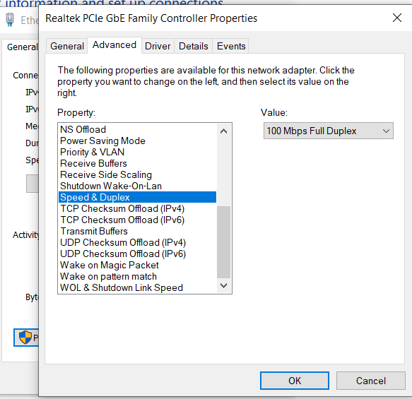

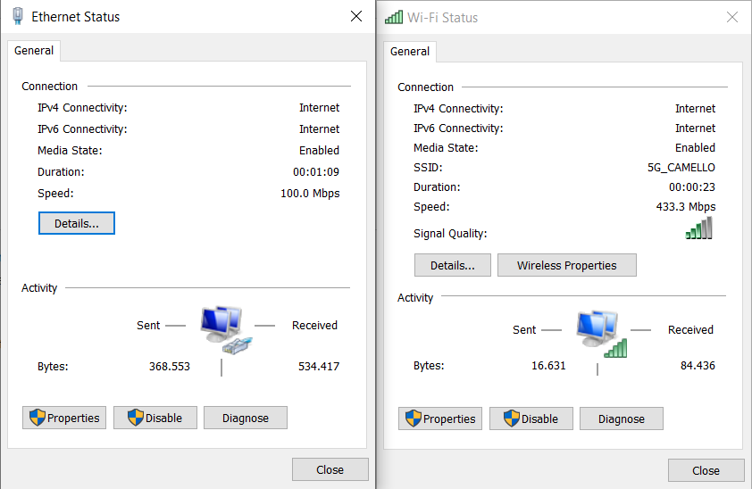

#### 08. Quais são as vantagens e/ou desvantagens dos meios de transmissão por cabos metálicos quando comparados aos meios de transmissão por fibra ótica?

A vantagem da internet a cabo é o preço. São diferenças notáveis entre fibra e cabo, qualquer um pode pensar que o preço da fibra óptica é maior, mas isto não é necessariamente verdade. Quando a tecnologia começou a se popularizar, os fios ópticos eram realmente mais caros que os cabos de cobre comuns. Porém, com o aumento da demanda, os custos caíram e hoje a Fibra óptica pode até sair mais barata em alguns lugares. Além disso, o uso de luz para transmitir sinais, no lugar da eletricidade, reduz, é claro, o uso de energia elétrica. A longo prazo, pode-se considerar um investimento. No entanto, o preço varia se procuramos conexões de **fibra ótica de alta velocidade**.
Qualquer serviço de fibra com velocidade superior a 50Mb será mais caro e seu preço aumentará à medida que você contratar mais velocidade.

#### Cabo:

Vantagens:

* É necessário pouco investimento, porque o cabo usa uma infra-estrutura já existente
* Possibilidade de falar ao telefone enquanto navega
* Boa relação velocidade/preço em comparação com outras conexões

Desvantagens:

* Em países com poucas infraestruturas é menos econômico
* A velocidade do cabo é muito menor do que as velocidades oferecidas pela F¡fibra óptica
* Um bom serviço de Cabo depende de fatores externos, como o status da fiação ou a distância da casa até a central telefônica

#### Fibra:

Vantagens:

* Permite alto fluxo de dados
* Fácil instalação
* Não produz interferência
* Grande resistência ao calor e ao frio
* Leve: nove vezes menos pesado que o fio de cobre
* Maior segurança de conexão

Desvantagens:

* Ainda não chega a muitas casas e em áreas rurais
* Receptores e transmissores são mais caros
* Não é possível unir a fiação, o que dificulta os reparos

#### 09. Qual o endereço MAC do computador com endereço IP 192.168.0.1?

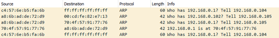

70:4f:57:91:77:76

#### 10. Cite 3 funções importantes da camada de enlace do modelo TCP/IP.

Oferecer serviços a camada de rede, detecção e correção de error de transmissão e regular o fluxo de dados de modo que um host mais rápido não sobrecarregue um mais lento. É responsável pela inserção de pacotes TCP/IP no caminho, e também por receber os pacotes fora dele. Dessa forma é conhecida também por ser responsável pela interface da rede, que compatibiliza a tecnologia com o protocolo IP. A camada de enlace, do modelo OSI, que no modelo TCP/IP são a camada de acesso a rede.

#### 11. Compare a quantidade de endereços do IPv4 com a quantidade de endereços do IPv6. Indique também qual a relação IP por habitante nos dois protocolos. Considere que a população
mundial tem 6 bilhões de habitantes.

A quantidade de endereços IPV4 fica em torno de 4 bilhões contra 340 undecilhões do IPV6, sucessor do IPV4.  A relação do IPV4 para população mundial fica 0,667 já em relação ao IPV6 temos algo como: 3,4 x 10 ^ 38  / 6 x 10 ^ 9.

#### 12. Foram estudadas 3 formas de combater a exaustão do IPv4: NAT, IPv6 e Endereços privados. Qual delas é uma solução definitiva para o problema da exaustão de endereços?

O NAT, como mencionado no roteiro de aprendizagem, garantiu alguns anos de vida ao IPV4, porém, não foi a solução definitiva, o IPV6 é o sucessor do IPV4, garantindo uma longevidade absurda, o IPV4, como visto na questão anterior, suporta uma quantidade absurda de endereços.

#### 13. Explique por que o protocolo IP apenas faz o envio de pacotes sem dar garantias de entrega. Forneça também o nome desse conceito.

O protocolo IP é não orientado à conexão, não garantindo que os pacotes IP cheguem ao seu destino nem se chegam pela ordem com que foram enviados. O IP é o protocolo responsável por definir o caminho que um pacote de dados deverá percorrer desde o host de origem até ao host destino, passando por uma ou várias redes onde poderá encontrar protocolos de conexão. O TCP particiona os dados recebidos da camada de aplicação em blocos menores, conhecidos como datagrama, logo em seguida, identifica os datagramas com cabeçalhos, fazendo com que o host destino possa recompor os dados, em casos de erro de transmissão o TCP tem o dever de retransmitir o pacote.

#### 14. Considere a figura abaixo que ilustra uma rede que interconecta diversos estados do Brasil, cada roteador dessa rede é identificado por uma letra, e estão conectados por links que estão identificados com seu tempo de resposta. Qual o caminho entre a rede A e a rede G com o menor tempo de resposta?

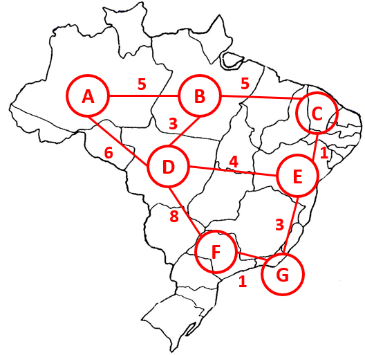

#### A → D → E → G = 13 ms.

#### 15. A maior diferença entre o TCP e o UDP está na questão da confiabilidade. Cite 3 mecanismos utilizados pelo TCP para garantir a confiabilidade de uma conexão.

O protocolo TCP agrega cabeçalhos nos bit de controle de fluxo e recebimento, sendo o TCP orientado a conexão, fazendo uma conexão dos dispositivos envolvidos antes de transmitir os dados, através do Acknowledgment, tendo uma velocidade menor, enviando os pacotes em sequência, detectação e correção dos erros, reenviando os pacotes se necessário, fazendo o controle de congestionamento e reconhecimento, todas essas características fazem com que o protocolo TCP seja mais confiável.

#### 16. O UDP é um protocolo da camada de transporte onde a maior característica é o envio rápido de pacotes, sem muitos atrasos. Forneça o nome de 3 protocolos (ou tecnologias) que
façam uso do UDP.

O Skype usa também o protocolo UDP para envio de mídias em suas vídeo-chamadas.

Comunicação com impressoras, sendo utilizado para descoberta desses dispositivos na rede, e para descoberta desses dispositivos na rede, fornecendo informações como nível de tinta e status da máquina.

O Discord utiliza o UDP para compartilhar mídia, vídeo-chamadas e chamadas de voz.

#### 17. Considerando a figura a seguir, existe uma requisição utilizando o protocolo DHCP. Qual o endereço IPv4 do servidor DHCP, e qual o endereço IP fornecido ao cliente?

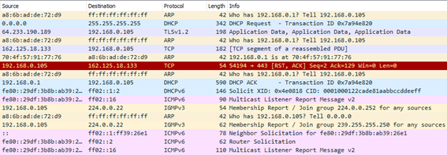

O IPV4 do servidor é: 198.168.0.105

IP do cliente: 162.125.18.133

#### 18. Monitore com o Wireshark o tráfego da sua rede, acesse o site ftp://speedtest.tele2.net/ usando seu browser. Use o filtro do Wireshark para exibir somente os pacotes relacionados a essa conexão FTP. Você deve capturar a tela do Wireshark e colocar setas para apontar as linhas onde os pacotes do 3-way handshake do TCP estão localizados. Observação: a captura da tela deve capturar a tela toda, inclusive com o horário e data na barra inferior para garantir a autenticidade da captura.

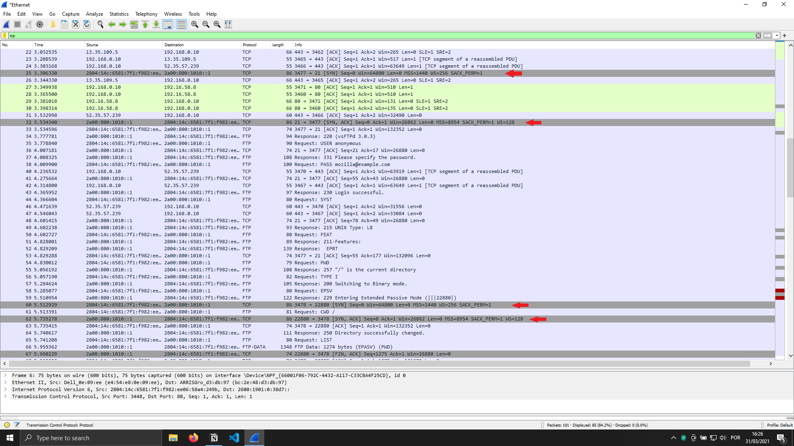

#### 19. Explique com suas palavras o que é SLA. Dê um exemplo de como um usuário doméstico pode mostrar ao seu provedor de internet que o mesmo não está cumprindo com o contrato.

Acordo de Nível de Serviço -É especificação, em termos mensuráveis e claros, de todos os serviços que o contratante pode esperar do fornecedor na negociação, apresenta prazos de contrato, termos de compromisso, suporte técnico, metas de nível de serviço. É um esclarecimento técnico do do contrato, são estabelecidos requisitos contratuais no que se refere a forma de entrega, responsabilidades e outros fatores que envolvem a relação contratante e fornecedor do serviço.

Referente a o exemplo solicitado, segundo o SLA deve haver disponibilidade na prestação do serviço, qualidade técnica, prazos e tempos de resposta, dentre outros, em casos de falhas na prestação do serviço sem qualquer justificativa, falta de atendimento do suporte e constante falta de disponibilidade, no caso da internet e softwares, deveriam ter a disponibilidade entre 99 e 99,99%, dentro desses casos é possível o contratante recorrer e solicitar uma indenização.

#### 20. Explique porque a perda de pacotes pode causar lentidão no acesso à internet.

A perda de pacotes pode ocasionar em, cada vez mais,  congestionamento da rede, consequentemente causando lentidão pela necessidade de reenvio, aumentando o tempo de resposta.

#### 21. A tecnologia de VPN é muito utilizada nas empresas para permitir que usuários acessem a rede da empresa, ou até mesmo trabalhem de “home office”. Também estudamos que a VPN pode ter outro uso, que é o de esconder o endereço real de um computador. Explique como a VPN pode esconder o endereço real de um computador.

Por meio de rede privada (VPN), conseguimos ter uma maior criptografia nas informações e nas comunicações entre hosts da rede privada é possível aumentar consideravelmente a confidencialidade dos dados que trafegam pela rede. Os custos de VPN ainda são mais em conta que fazer a utilização de links dedicados, ainda mais com o aumento das distancias.

#### 22. Quais as vantagens em se fazer traffic shaping no tráfego de saída de uma empresa?

Como o próprio nome diz, traffic shaping é a metodologia de modelar o tráfego de uma rede, seja para priorizar certos tipos de serviços, usuários e máquinas em uma determinada rede, ao utilizar no tráfego de saída de uma rede, podemos melhorar a entrega da empresa para o usuário, melhorar o tempo de resposta e em geral priorizar o recebimento do usuário.

#### 23. Considerando os testes White Box, Gray Box e Black Box, qual deles realiza um teste que simula um ataque de alguém que conhece a empresa e tem credenciais válidas?

Nesse caso, o que mais se aproxima das informações prestadas é o teste Gray Box.

#### 24. O que é um Hacker Ético?

Hacker ético é aquele que ao acessar um sistema ou informações privadas, reporta ao dono (seja empresa ou fornecedor de serviço) as informações sobre as falhas de segurança, um hacker ético pode trabalhar pra uma empresa ou várias, pode até ser freelancer, existem inúmeras empresas, como microsoft, facebook, dentre outras, que pagam enormes quantias por falhas de seguranças ou bugs que sejam encontrados e reportados, também conhecidos, nesse caso, como bug bounties.

#### 25. Considerando a requisição HTTP abaixo, identifique: o nome do servidor, a URL, e qual usuário e senha foram utilizados para acessar o sistema. Deve-se descobrir qual a senha original, não apenas o hash.

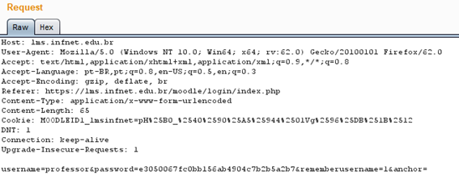

usuário → professor

hash → e3050067fc0bb156ab4904c7b2b5a2b7

senha → senhaforte

#### 26. Considere a seguinte captura do protocolo SMTP feita no Wireshark de uma conexão e descubra qual o usuário e senha utilizados.

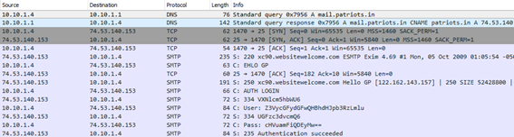

Usuário → Z3VycGFydGFwQHBhdHJpb3RzLmlu → [gurpartap@patriots.in](mailto:gurpartap@patriots.in)

Senha → cHVuamFiQDEyMx== → punjab@123

#### 27. Forneça 5 itens que você considera fundamentais em uma política de segurança corporativa.

- Uma infraestrutura de rede impecável, de forma que o sistema esteja sempre no ar e integro, para evitar ataques aos servidores, ataques que possam destruir as informações, os bancos de dados da empresa.
- Confidencialidade com os dados dos usuários, os dados, dos usuários, devem ser tratados de forma que praticamente 99.9% da empresa não tenha acesso, apenas os profissionais que devem tratar esses dados no banco de dados, ou os profissionais de segurança da informação, fazendo com que seja uma informação bem internalizada da empresa, focando sempre em contratar profissionais que tenham sua integridade e inabalável.
- Integridade dos dados, de forma que eles sejam passados aos usuários como realmente devem ser, sem sofrerem alterações que prejudiquem a passagem de informação, evitando que qualquer alteração indesejada ou acidental ocorra.
- Sistemas de autenticação blindados, evitando qualquer tipo de acesso ao sistema ou banco de dados de forma indesejada
- Engenharia social para evitar qualquer tipo de hackeamento físico, do tipo que o invasor se aproveita das falhas de segurança físicas da empresa, conseguindo chegar e acessar os dados diretamente de dentro do local.

#### 28. Quando falamos de ataque de força bruta, qual é a forma mais eficiente, na sua opinião, de evitar o ataque? Cite 2 formas de proteção.

De forma geral, os sistemas, que irão guardar informações sensíveis sobre o usuário, devem fazer com que o usuário utilize senhas mais complexas, com mais tipos de caracteres, com um número mínimo de extensão da senha e utilizando sistemas como captchas, que verificam se é uma máquina ou usuário tentando fazer o acesso, limitar a quantidade de tentativas, enviando alertas ao email do usuário, pode ser outra medida que garante maior segurança, fazendo com que programas utilizados para quebrar senhas, não tenham eficácia.

#### 29. Quando o assunto é perda/recuperação de dados, qual o risco do proprietário de um celular,
ou de uma câmera, quando se vende o aparelho para outra pessoa?

No geral, se deve fazer toda uma limpeza nos caches do aparelho, logo em seguida a remoção de chips e cartões de memória, após isso, fazer um backup e uma a formatação completa do aparelho para garantir que os dados foram removidos, logo em seguida se recomenda fazer uma verificação se realmente os dados em geral foram apagados.

#### 30. Considerando a imagem já vista no material, que é mostrada abaixo, encontre 3 problemas que estão presentes na imagem, mas que não estavam listados diretamente na política de segurança.

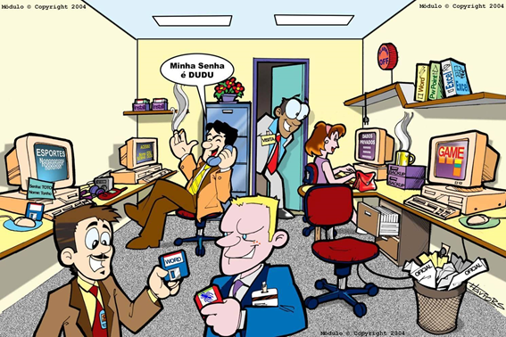

Podemos observar na imagem máquinas logadas, sem que o operador esteja próximo, exposição de usuários e senhas, compartilhamento de senhas, compartilhamentos de discos, documentos da empresa jogados em lixeiras que não foram descartados de forma apropriada (destruídos), acesso de pessoas de fora da empresa ao escritório, podendo visualizar o trabalho dos funcionários de forma indiscriminada.