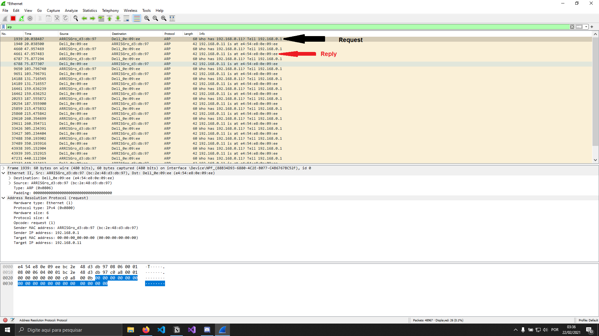
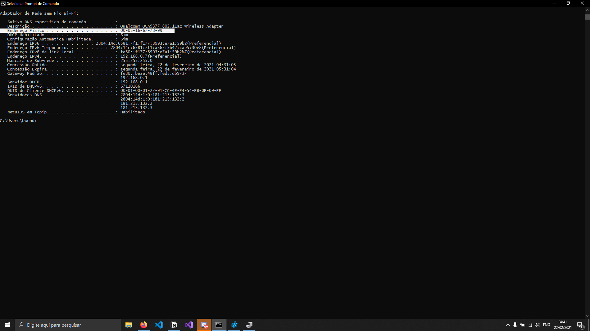
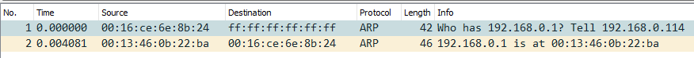

# Arquitetura de Redes de Computadores

## Teste de Performance 01  
### Questões discursivas  

#### 1. Descreva os principais usos das redes de computadores. Pesquise e descreva tendências para o futuro das redes de computadores e da Internet. Por fim, argumente por que as redes de computadores e a Internet tiveram tanto sucesso em um espaço de tempo tão pequeno.  

> O uso principal de redes está relacionado ao compartilhamento de recursos, com objetivo de levar todos os programas, equipamentos e especialmente dados ao alcance de todas as pessoas na rede, independente da localização física do recurso e do usuário. O uso de redes de computadores fez com que as empresas não precisassem usar os computadores de forma independente. As redes são  compartilhar recursos físicos, como impressoras, scanners e gravadores de CDs, seja compartilhar informações. Todas as empresa de grande e médio porte e muitas empresas pequenas têm grande necessidade de informações on-line, pesquisa ou disponibilidade de serviços. As redes de computadores estão no dia-a-dia de quem acessa seus celulares e computadores, acessando nuvens que contém conteúdo.

> Sobre o futuro das redes de computadores, tudo indica que teremos um cenário onde tudo será automatizado e migrado para as "nuvens", no caso grandes datacenters que terão capacidades absurdas de gerenciamento e, atualmente, já possuem a necessidade de engenheiros e cientistas de dados para gerenciar da melhor forma  possível todo conteúdo que as redes enviarão via antenas diretamente aos usuários, um futuro sem fios.

> Conforme o surgimento da internet as empresas viram que seus dados e negócios tinham potencial de alcançar o mundo inteiro, avançando com a globalização, tudo isso graças a os avanços que a internet da desde os anos 80, e, como o avanço da tecnologia ocorre de maneira exponencial, tivemos um rápido avanço levando conexão para todos cada dia mais e com melhor qualidade.

#### 2. Suponha que você trabalhe em uma empresa que precisa conectar duas redes situadas a 100 metros de distância uma da outra a uma velocidade de 10 Gigabits por segundo. Qual tipo de cabeamento você utilizaria e por quê?

> Usaria cabeamento Cat6 (categoria 6), assim ele suportaria velocidades de até 10 Gigabits, e com distancias até 100m, sendo perfeito para o cenário mostrado, sendo que esse cabeamento, em redes domésticas, dificilmente usa todo seu potencial, sendo uma boa opção para empresas.

#### 3. Faça uma pesquisa e encontre as principais fontes de interferência em uma rede 802.11. Depois, monte uma lista com pelo menos 3 recomendações para que uma rede 802.11 tenha um melhor desempenho (seja velocidade ou qualidade do sinal).

> Barreiras físicas, como paredes e principalmente metais, como a malha de metal que fica entre o cimento do teto, caso queira acessar uma conexão que está vindo de um andar diferente, o alcance é um fator que varia, dependendo do tipo de placa 802.11, corpos com grandes concentrações líquidas também são um grande obstáculo e finalmente temos micro-ondas, fornos, transmissores de rádio e outros aparelhos que operam na mesma frequência que os das redes wireless.

#### 4. Quais são as diferenças entre os padrões 802.11 b, g, n e ac? Monte uma tabela com os detalhes técnicos mais pertinentes.

> **IEEE 802.11a:** Esse padrão é usado normalmente em empresas que utilizam grande tráfego de informações. Uma vantagem ao utilizar esse padrão é ter altas velocidades e ausência de interferências. Esse padrão Wi-Fi é para frequência 5 GHz com capacidade teórica de 54 Mbps. Nesse padrão temos o problema do alcance, que é para curtas distâncias.

> **IEEE 802.11b:** Padrão mais usado para redes domésticas e encontrado em empresas de pequeno porte. Sua vantagem é seu alcance. A sua velocidade costuma ser inferior às outras, sendo isso sua desvantagem. O padrão Wi-Fi para frequência 2,4 GHz com capacidade teórica de 11 Mbps.

> **IEEE 802.11g:** Esse padrão poder ser comparado ao (b), porém, se comparado a velocidade, esse padrão costuma responder melhor. Igualmente ao padrão (b), é amplamente usado em residência e empresas de porte pequeno. Para tanto, como desvantagem, o alcance costuma ser menor ao padrão (b). O padrão Wi-Fi para frequência 2,4 GHz com capacidade teórica de 54 Mbps.

> **IEEE 802.11n (Wi-fi 4):** Nomeado como Wi-fi 4 pela Wi-Fi Alliance (organização responsável pela certificação dos padrões Wi-fi), o padrão Wi-fi 802.11n é ultrapassado. O Wi-fi 4 utiliza as frequências de 2,4Ghz e 5Ghz (opcional). A transferência para o IEEE 802.11n fica entre 54Mbit/s e 600Mbit/s.

> **IEEE 802.11ac (Wi-fi 5):** Nomeado como Wi-fi 5 pela Wi-Fi Alliance, o padrão Wi-fi 802.11ac é a tecnologia mais utilizada hoje em dia. Temos algumas mudanças comparado ao padrão Wi-fi 802.11n, temos o aumento da amplitude de canais (80Mhz ou 160Mhz contra 40Mhz) na banda de 5GHz, maior numero de fluxos (até 8 antenas contra quatro) e a adição da tecnologia MIMO multiusuário (MU-MIMO), permitindo uma alta taxa de transferência de dados mesmo em 
ambientes com grande número de dispositivos cliente.

#### 5. Explique a diferença entre Comutação de Circuitos e Comutação de Pacotes. Forneça pelo menos um exemplo de cada conceito.

> A comutação de circuito é usada no tráfego de voz, ela é a base para o sistema telefônico tradicional, o circuito estabelecido ficava reservado durante toda a duração da conversação. A comutação de pacotes é usada para o tráfego de dados, sendo por sua vez, a base para a Internet e para a Voz sobre IP.

> [Comparação entre comutações de circuitos e pacotes](https://www.notion.so/0401de1f528a4ed2a385112d00c6c937)

> fonte: [https://www.teleco.com.br/tutoriais/tutorialvoipconv/pagina_3.asp](https://www.teleco.com.br/tutoriais/tutorialvoipconv/pagina_3.asp)

#### 6. Foi estudado que uma rede pode ser classificada quanto a sua topologia física e cobertura geográfica. Considerando essas classificações, detalhe como a rede Wi-Fi é classificada.

> Topologia Wireless, de rede sem fio, seria uma WLAN, no caso de ser analisada do ponto de vista de um roteador fornecendo rede a uma residência, no caso da distribuição diretamente da provedora de internet, visualizamos como WMAN, como sendo uma rede metropolitana, pelo fato de sair da provedora e ir para a residência.

#### 7. O hub é um equipamento de rede que foi substituído pelo switch. Qual a diferença entre eles? Qual situação indesejada em uma rede que deixou de existir com os switches?

> O Hub tinha como objetivo interligar computadores em uma rede local, ele pega dados de uma máquina e transmite para outra, porém durante o processo existe um congestionamento na rede, que as demais máquinas devem esperar o processo encerrar para executar outras transferências, as redes conectadas por hubs apresentam lentidão. Os Switches são aparelhos que tem funções parecidas com as do Hub, porém criam canais de comunicação exclusivos para as máquinas que estão trocando dados na rede. No caso o Switch solucionou a questão da lentidão e limitação que o hub traz pra uma rede, assim fazendo com que a rede não fique congestionada, estabelecendo conexões paralelas.

#### 8. O que diferencia o modelo OSI do modelo TCP/IP? Eles têm o mesmo objetivo? Por que um virou padrão de mercado e outro é apenas uma referência? Seja profundo em sua resposta.

> Os modelos trabalham em com modelos de camadas, tratam de protocolos independentes, porém são diferentes. O modelo OSI possui 7 camadas, o TCP/IP apenas 4, o TCP/IP mescla as camadas 1 e 2 do modelo OSI como camada de aplicação. A camada de Redes do OSI é chamada de Internet no TCP/IP. Os modelos foram desenvolvidos com objetivo de padronização das redes. O modelo OSI, modelo de referência da ISO, se tornou um modelo que seria base para garantir compatibilidade, interoperabilidade, portabilidade e escalabilidade. O modelo OSI não é uma arquitetura de redes, pois não especifica os serviços e protocolos exatos que devem ser usados em cada camada. Ele apenas informa o que cada camada deve fazer.

#### 9. Pesquise o que é “Internet das Coisas” e explique o que é esse novo conceito.

> Objetos que possuem sensores, softwares e outras tecnologias, o objetivo é conectar e trocar dados com outros dispositivos, tornando os objetos interconectados. Os dispositivos podem ser domésticos, ferramentas industriais, dentre outros. A tendência é o aumento drástico desses objetos, fazendo com que no futuro tenhamos casas totalmente inteligentes, roupas e outros utilitários. A Conectividade, sensores, processamento em nuvem, machine learning e a Inteligência artificial, tornam possível o IoT

## Questões práticas
#### 10. Monitorar com o Wireshark o tráfego da sua rede e capturar uma consulta ARP (request e reply) que mostre o endereço MAC e o endereço IP. Você deve capturar a tela do Wireshark e colocar setas para apontar as linhas onde o request e o reply acontecem. Observação: a captura da tela deve capturar a tela toda, inclusive com o horário e data na barra inferior para garantir a autenticidade da captura.

#### 11. Mostre a tela de configuração de "Filtro de endereço MAC" de um ponto de acesso Wi-Fi, onde é possível configurar os endereços MAC de clientes autorizados a acessar a rede Wi-Fi. Observação: a captura da tela deve capturar a tela toda, inclusive com o horário e data na barra inferior para garantir a autenticidade da captura.

#### 12. Altere o endereço MAC de uma placa de rede. Você deve capturar a tela com o endereço MAC original (usando o comando ipconfig /all) e depois com o endereço alterado. Observação: a captura da tela deve capturar a tela toda, inclusive com o horário e data na barra inferior para garantir a autenticidade da captura.

Anterior:

Modificado:

#### 13. Faça uma tabela comparativa com os custos para registrar e hospedar um site com domínio “.com.br”. Faça a cotação em pelo menos 3 empresas e indique o nome da empresa, valor, principais recursos oferecidos (por exemplo: armazenamento ilimitado, e-mail gratuito, etc.).

---

### GoDaddy:

> R$:19,99 no primeiro ano, necessária a compra de dois anos e o segundo por R$:64,99. Um dos principais recursos oferecidos pela GoDaddy é o investimento em segurança que a empresa tem. A GoDaddy se intitula o maior registrador do mundo, conhecida também por possuir um suporte premiado.

### Registro.br:

> Ao registrar um domínio .br você está, independente da empresa, fazendo pelo [Registro.br](http://registro.br), no caso de utilizar outra empresa, está apenas sendo utilizada a empresa como intermediária do processo, então ao fazer diretamente pelo Registro.br você não deixa suas informações com demais sites e acaba tendo esse ponto a mais na segurança.

### HostGator:

> A HostGator possui um suporte disponível 24h todos os dias, segundo eles um painel de controle interativo e fácil de usar, Proteção Whois (ID Protect) – que permite manter ocultos dados sensíveis como nome, endereço e telefone, para domínios internacionais (.com, .org e .net).
### Locaweb:
> O serviço de registro de domínios é oferecido por um preço único para todas as extensões disponibilizadas. No primeiro ano, qualquer domínio pode ser registrado por R$ 36,90, com renovação por R$ 82,90, valor acima da média de mercado. A empresa não oferece o recurso de privacidade de domínio.

 Empresa | Detalhe    | Privacidade de domínio    | Preço/Ano     
------------ | ------------- | ------------- | ------------- 
Registro.br | Preço mantido na renovação | Não se aplica | R$ 40,00 
Godaddy | Maior variedade de extensões | Paga à parte | R$ 19,99 
HostGator | Menor preço na compra de 2 anos | Paga à parte | R$ 39,99 
Locaweb | Renovação entre as mais caras | Paga à parte | R$ 36,90 

---

#### 14. Faça uma tabela comparativa com os custos para registrar e hospedar um site com domínio “.com” em empresas estrangeiras. Faça a cotação em pelo menos 3 empresas e indique o nome da empresa, valor, principais recursos oferecidos (por exemplo: armazenamento ilimitado, e-mail gratuito, etc.). Compare com os preços nacionais do exercício anterior e argumente o motivo pelo qual existe diferenças de preços.

Empresa/Opções | A2 Hosting    | ACCU    | DreamHost     | Liquid Web     | Ionos     |
------------ | ------------- | ------------- | ------------- | ------------- | -------------
Shared Hosting | Sim | Sim | Sim | Sim | Não |
VPS Hosting | Sim | Sim | Sim | Sim | Não |
Dedicated Hosting | Sim | Sim | Sim | Sim | Sim |
WordPress Hosting | Sim | Sim | Sim | Sim | Sim |
Cloud Hosting | Sim | Sim | Sim | Sim | Sim |
Linux Servers | Sim | Sim | Sim | Sim | Sim |
Windows Servers | Sim | Sim | Não | Sim | Sim |
24/7 Customer Support | Sim | Sim | Sim | Sim | Sim |
Price/month | US$9.31 | US$3.36 | US$3.59 | US$19 | US$10 |

#### 15. Veja a seguir a captura de dois pacotes ARP feita com o software Wireshark. Explique o que estava acontecendo no momento em que os pacotes foram capturados. Indique qual era o endereço MAC relativo ao endereço IP 192.168.0.114.

