

---

<h2 align="center"> INSTITUTO INFNET  
ESCOLA SUPERIOR DA TECNOLOGIA DA INFORMAÇÃO 
CURSO DE ENGENHARIA DE SOFTWARES</h2>

 

 

 

<h4 align="center" padding-top="200">Francisco Alves Camello Neto</h4>

 

 

 

<h3 align="center"> TP 3. Arquitetura de Redes de Computadores</h3>

 

 

 

 

<h4 align="center">Profº Adriano Saad</h4>

 

---

Brasília  15 de março de 2021

  

 

 

 

### Questões discursivas

#### 1. Comente 3 funcionalidades que podem existir na camada de aplicação do modelo TCP/IP.

A camada mais próxima do usuário final, ela tem por função servir como terminal para as operações que ocorrem em uma rede.

Capacidade de identificar codificação de caracteres para a conversão adequada e fazer criptografia, define uma interface de comunicação entre os hosts, representação de estruturas, padronizadas neste nível, geralmente usando XML.

Quando alguém precisa requisitar algo que está em uma rede, é na camada de aplicação que irá ser feita a requisição ou recebimento de informações, fornecimento de serviços de rede "reais", ao usuário. A camada de aplicação é responsável por gerenciar e deixar disponível ao usuário, todos os sistemas e ferramentas a ele destinados.

#### 2. Considerando a requisição HTTP abaixo, identifique: o nome do servidor, a URL, o Browser, e qual usuário e senha foram utilizados para acessar o sistema.

- Nome do servidor: exemplo.com
- URL: exemplo.com/index.php?acao=login
- Browser: Mozilla Firefox
- Usuário: donald
- Senha: a1b2c3d4

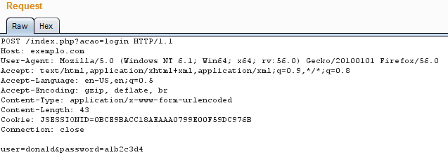

#### 3. Faça uma captura utilizando o Wireshark de tráfego DNS (UDP porta 53). Você deve capturar a tela com o resultado dos testes e apontar com setas onde estão os pacotes relevantes. Observação: a captura da tela deve capturar a tela toda, inclusive com o horário e data na barra inferior para garantir a autenticidade da captura. Dica: Inicie a captura de pacotes com o wireshark, e só depois acesse algum site.

Antes da captura:

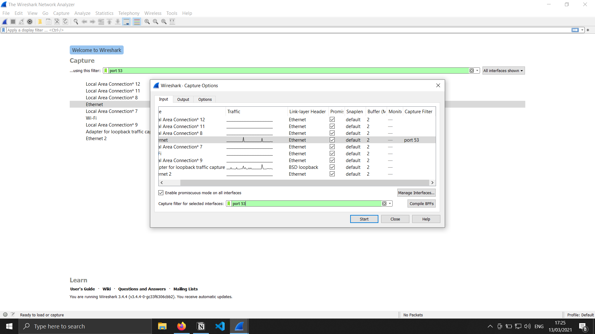

Iniciando a captura (Apenas o firefox, notion e kaspersky abertos):

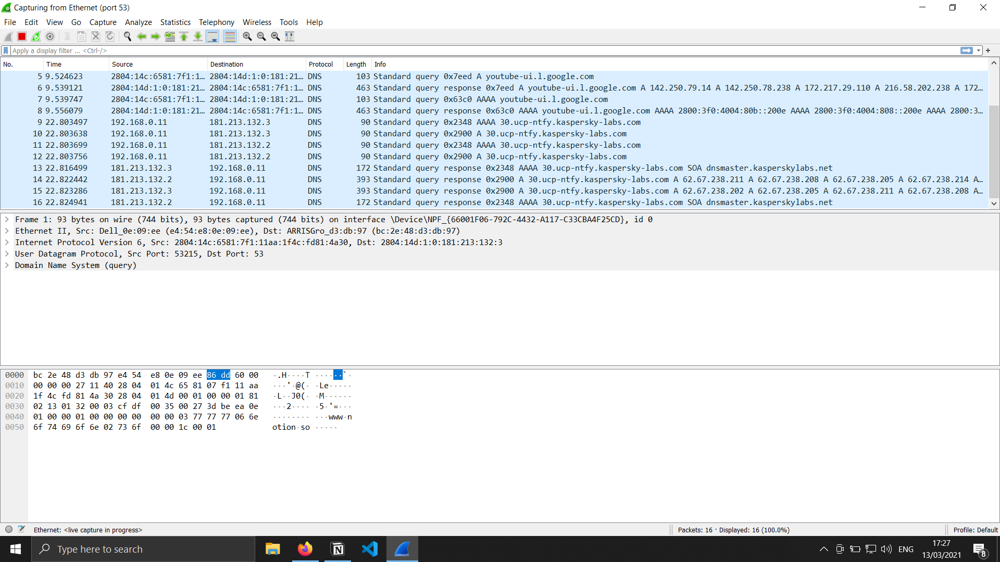

Final da captura (Ao acessar o site do LinkedIn):

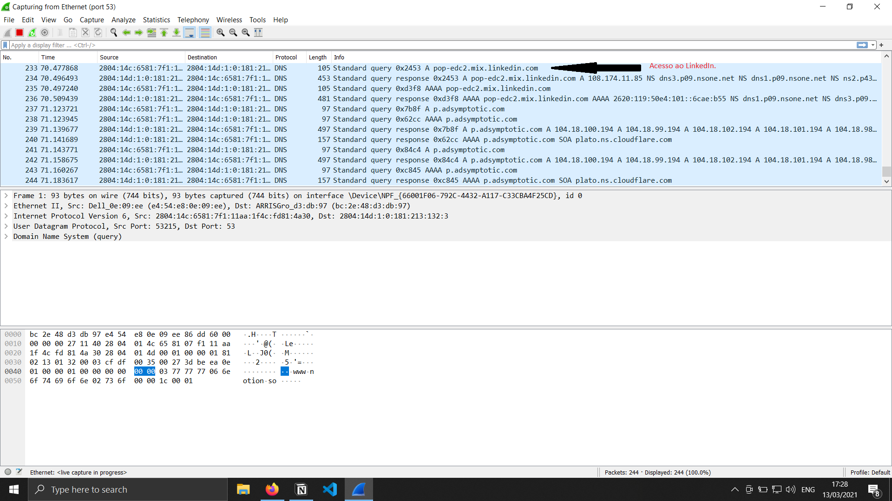

#### 4. Faça uma captura utilizando o Wireshark de tráfego DHCP (UDP porta 67 ou 68). Você deve capturar a tela com o resultado dos testes e apontar com setas onde estão os pacotes relevantes. Observação: a captura da tela deve capturar a tela toda, inclusive com o horário e data na barra inferior para garantir a autenticidade da captura. Dica: Inicie a captura de pacotes com o wireshark, e depois conecte e desconecte o cabo/placa de rede para ganhar um novo endereço IP.

A captura foi feita filtrando apenas os protocolos DHCP, portanto não foi necessário sinalizar os pacotes relevantes.

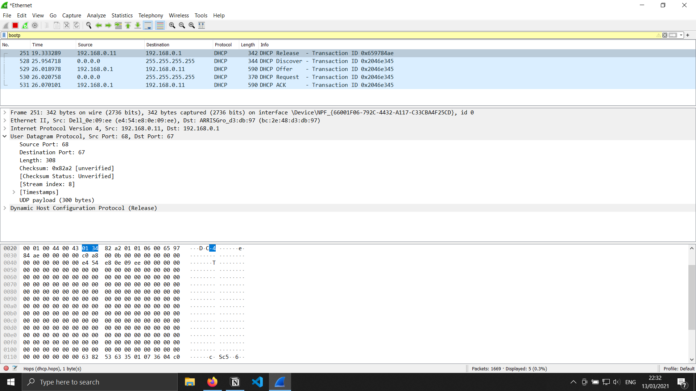

#### 5. Explique com suas próprias palavras os motivos pelos quais gerenciar uma rede é importante.

O gerenciamento de uma rede está associado a controlar os acessos, fazer com que a rede se mantenha estável, descongestionada, se possível melhorar a eficiência da rede, fazer com que a eficiência influencie em menores custos operacionais para a rede, manter a rede e as informações dela seguras, dentre outros motivos o gerenciamento de uma rede se faz tão importante. O gerenciamento de uma rede está associado ao controle de acessos, documentação de funcionamento e configuração da rede, auxílio ao usuário, disponibilidade e desempenho, gerência de problemas na rede, controle de inventário e etc.

#### 6. Faça uma pesquisa na internet e liste pelo menos 3 softwares de monitoramento ou de gerência de redes.

Wireshark: É um software livre e de código livre para analisar pacotes, ele analisa o tráfego de uma rede e o disponibiliza em uma interface gráfica.

Nmap: É um software que faz port scan, utilizado para verificar a segurança de máquinas, descobrir serviços/servidores em uma rede. Dispõe uma interface gráfica e de console. O software Nmap faz a descoberta de hosts, scaneia portas(TCP e UDP), detecção de serviços para descobrir nome e versão, detecção de sistemas operacionais e dentre outras funcionalidades.

Pcap: É uma API que captura o tráfego de uma rede, softwares de monitoramento de redes utilizam as portabilidades atuais do Pcap (libpcap(Unix), Npcap(windows)) para fazer a captura de pacotes que trafegam na rede.

Spiceworks: É uma ferramenta de monitoramento de redes, com uma função de alerta em tempo real. É um Dashboard em tempo real, dá a possibilidade de monitorar os status de dispositivos e serviços, e alertando se valores específicos estão diferentes dos critérios prédefinidos.

#### 7. Usuários ligaram para o suporte reclamando que não conseguiam imprimir seus arquivos na impressora da empresa. A primeira ação do funcionário do suporte foi executar um PING no endereço IP da impressora. Explique por que ele fez isso.

O PING pode ser usado para avaliar um sistema, ao fazer mudanças na rede, ou até a mesma apresentar problemas. Usando um tipo simples de pacote, temos uma resposta do subsistema de comunicação (TCP/IP) do sistema operacional, é bem simples de ser executado e rápido, para fazer uma verificação simples, avaliando a conexão e o tempo de comunicação com outro ponto. O funcionário do suporte fez essa verificação com objetivo de verificar se a impressora estava conectada na rede.

#### 8. Acesse o site [http://www.brasilbandalarga.com.br/bbl](http://www.brasilbandalarga.com.br/bbl) e faça, de sua residência ou de um local cuja velocidade contratada de serviço de internet você conheça, o teste de velocidade da internet em dois momentos diferentes, de preferência em horários bem distintos, como manhã e noite. Você deve capturar a tela com o resultado dos testes. Observação: a captura da tela deve capturar a tela toda, inclusive com o horário e data na barra inferior para garantir a autenticidade da captura.

captura 1:

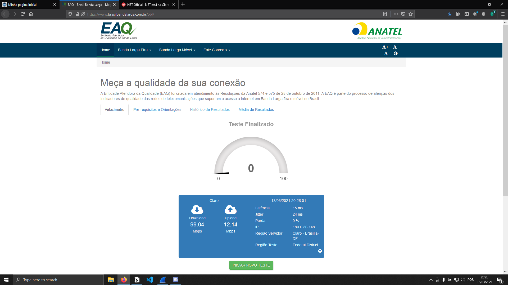

captura 2:

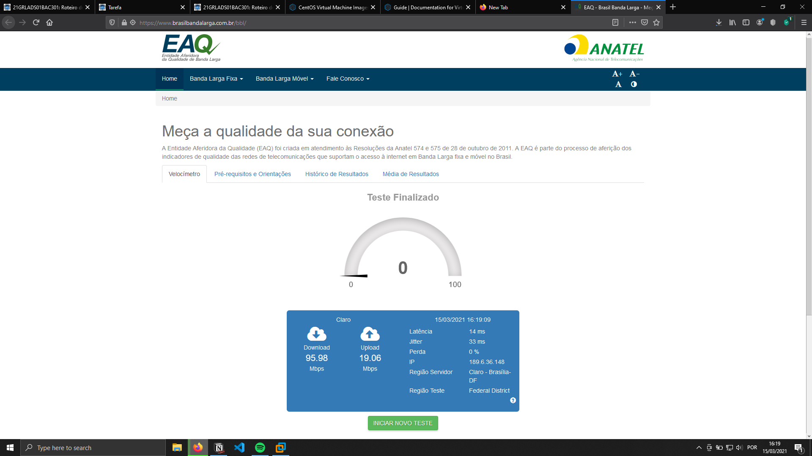

#### 9. Com base no resultado do teste anterior, informe qual a velocidade do link de internet onde o teste foi feito e explique se o provedor está cumprindo com a velocidade mínima contratada.

A velocidade aproximada da internet que foi capturada chegou a 100 Mbps, porém a velocidade contratada é de 120 Mpbs, isso se dá pelo cabo Ethernet usado ser Cat5, ou inferior, e não suportar velocidades superiores.

#### 10. Um administrador de rede executou um PING em um servidor interno e o resultado demonstrou que tudo estava correto. Logo depois, executou um PING em outro servidor interno, que estava no mesmo switch do primeiro servidor, e o resultado demonstrou que estava ocorrendo perda de pacotes. Liste pelo menos 3 problemas que poderiam causar esse tipo de perda de pacotes.

Erros no Hardware: Dispositivos ou peças do dispositivo também podem quebrar ou ter erros. Podemos ter sobrecargas no hardware, falhas de alimentação energética, dentre outras.

Sobrecarga no servidor: No segundo servidor, podemos estar tendo uma sobrecarga no tráfego da rede, levantando erros de transmissão e consequentemente ocasionando a perda de pacotes.

Erros de software: Diferenças de versão dos softwares e falta de algum pacote que seja de um servidor para o outro pode estar ocasionando perda de pacotes e diferenças entre os dois servidores internos.

Desempenho dos dispositivos: Os dois dispositivos são hardwares diferentes, ocasionando maior falta de desempenho de um em relação ao outro, ocasionando perda de pacotes de um lado.

#### 11. Muitas empresas possuem redes wireless (wifi) dentro do ambiente corporativo. Faça uma pesquisa e liste pelo menos 3 critérios importantes para gerenciar redes wireless.

Deve ser feita uma configuração bem planejada e de forma correta da rede sem fio, com objetivo de cobrir todos os locais que devem ser servidos pela rede wi-fi, garantindo a qualidade de sinal, testando com um Site Survey para garantir a qualidade do sinal em cada ponto, portanto, disponibilidade é um critério importante. Deve ser controlado todos os acessos e monitoramento dos serviços usados na rede para garantir a segurança da rede, manter os dados sensíveis seguros e protegidos de possíveis acessos não autorizados, garantir a integridade dos dados, a segurança da rede é uma questão importante nos critérios de uma rede wireless. Podemos ter caso de uso de rede com servidores locais, onde é necessário ter backups e mais de um servidor para garantir disponibilidade, problemas como falha energética, dentre outros, podem afetar um servidor, portanto o outro mantém a rede estável e os dados seguros, em casos de utilização de nuvens de empresas terceirizadas (Amazon AWS, Google Cloud, Microsoft Azure e etc.), se faz necessária a contratação de funcionários que sejam especializados nesses serviços, para que seja configurada da forma mais otimizada para a empresa, de forma menos custosa e mais eficiente.

Qualidade da rede, disponibilidade e segurança são critérios importantes no gerenciamento das redes wireless.

#### 12. Execute o comando “_ping -n 1000_ [www.infnet.edu.br](http://www.infnet.edu.br/)”. Ao fim do programa, será exibido um resumo dos testes efetuados. Interprete os resultados de perda de pacotes e de atraso médio. Você deve capturar a tela com o resultado dos testes. Observação: a captura da tela deve capturar a tela toda, inclusive com o horário e data na barra inferior para garantir a autenticidade da captura.

O site [www.infnet.edu.br](http://www.infnet.edu.br) não devolve qualquer resposta, provavelmente está com acesso bloqueado. Portanto foi feito o comando usando o site do [google.com](http://google.com)

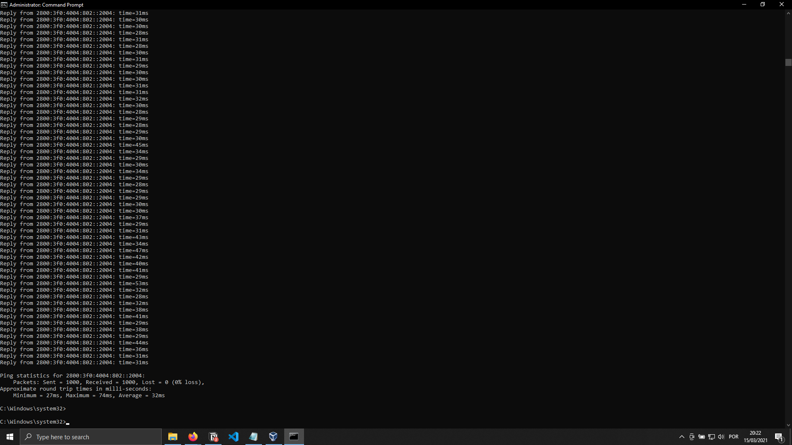

- Ping statistics for 2800:3f0:4004:802::2004:
- Packets: Sent = 1000, Received = 1000, Lost = 0 (0% loss),
- Approximate round trip times in milli-seconds:
- Minimum = 27ms, Maximum = 74ms, Average = 32ms

Pode-se observar que a perda de pacotes foi 0 e o atraso médio do ping foi de 32ms.

#### 13. Faça a instalação de uma máquina virtual conforme descrito na “_Etapa 6 - Prática - Como simular redes com velocidades menores e perda de pacotes_”. Carregue um servidor HTTP localmente no seu computador e disponibilize um arquivo entre 50Mbytes a 100Mbytes, ou escolha um arquivo de tamanho semelhante na internet para ser o arquivo de referência. Refaça o **Teste 1** você mesmo e apresente o resultado do teste. Você deve capturar a tela com o resultado dos testes. Observação: a captura da tela deve capturar a tela toda, inclusive com o horário e data na barra inferior para garantir a autenticidade da captura.

Iniciando o teste, verificando as configurações da máquina virtual:

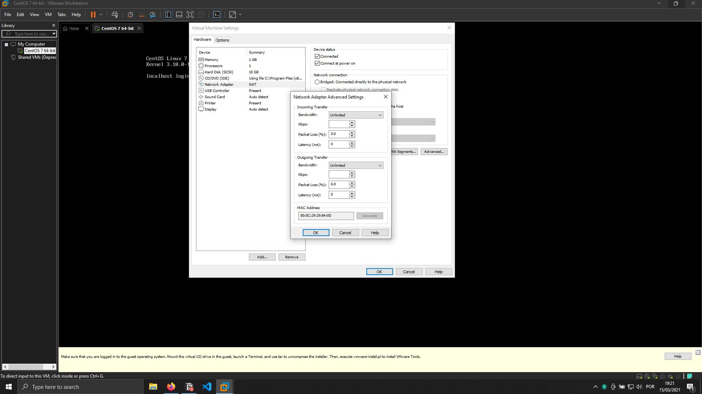

#### 14. Seguindo a linha do exercício 13, refaça o _Teste 2_ você mesmo e apresente o resultado do teste. Você deve capturar a tela com o resultado dos testes. Observação: a captura da tela deve capturar a tela toda, inclusive com o horário e data na barra inferior para garantir a autenticidade da captura.

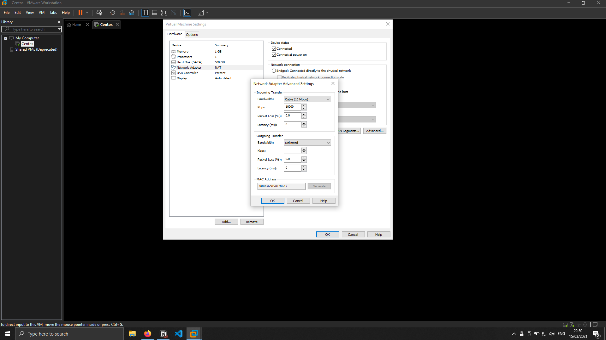

#### 15. Seguindo a linha do exercício 13, refaça o _Teste 3_ você mesmo e apresente o resultado do teste. Você deve capturar a tela com o resultado dos testes. Observação: a captura da tela deve capturar a tela toda, inclusive com o horário e data na barra inferior para garantir a autenticidade da captura.

#### 16. Seguindo a linha do exercício 13, refaça o _Teste 4_ você mesmo e apresente o resultado do teste. Você deve capturar a tela com o resultado dos testes. Observação: a captura da tela deve capturar a tela toda, inclusive com o horário e data na barra inferior para garantir a autenticidade da captura.

#### 17. Foi estudado a aplicação de QoS para tráfego multimídia, como VOIP. Dê pelo menos 2 exemplos de outro tipo de tráfego que poderiam se beneficiar do QoS.

O QoS é interessante para quem quer prioridade de conexão na reprodução de vídeos, serviços de streaming, jogos online e etc. Empresas usam o QoS para seus serviços de VoIP para suporte ao usuário e sistema de vendas, porém, serviços os serviços de já mencionados anteriormente, comunicação em live, streaming, dentre outros podem ser serviços que podem se beneficiar do QoS.

#### 18. Explique com suas palavras porque não é possível priorizar um tráfego (QoS) fora dos limites da rede da empresa.

O protocolo IP trata todos os pacotes de forma igual, não garante todos os serviços nos roteadores, tudo isso pelo conceito do melhor esforço. O QoS é habilitado no roteador, portanto o serviço fora dos limites da empresa não tem como fazer esse QoS pelo fato de ser configurado no roteador.

#### 19. Veja novamente o item “Etapa 6 - Prática - Como esconder seu endereço real na internet”. Faça o teste de esconder o seu endereço IP(pode ser no computador ou no celular). Você deve capturar a tela com o resultado dos testes _antes e depois de mudar de endereço IP_. Observação: a captura da tela deve capturar a tela toda, inclusive com o horário e data na barra inferior para garantir a autenticidade da captura.

Antes da utilização de uma VPN:
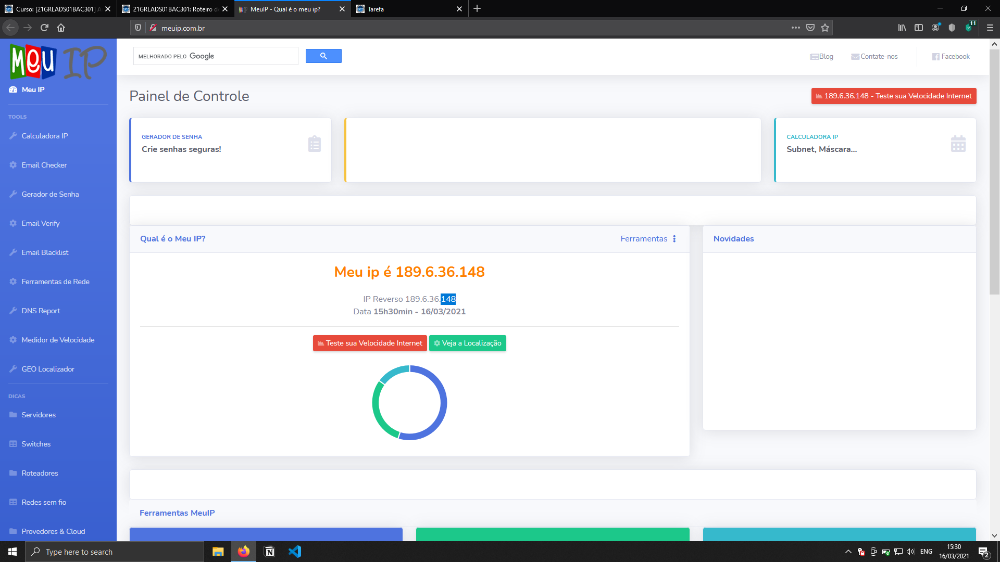

Ao utilizar a VPN do Kaspersky:
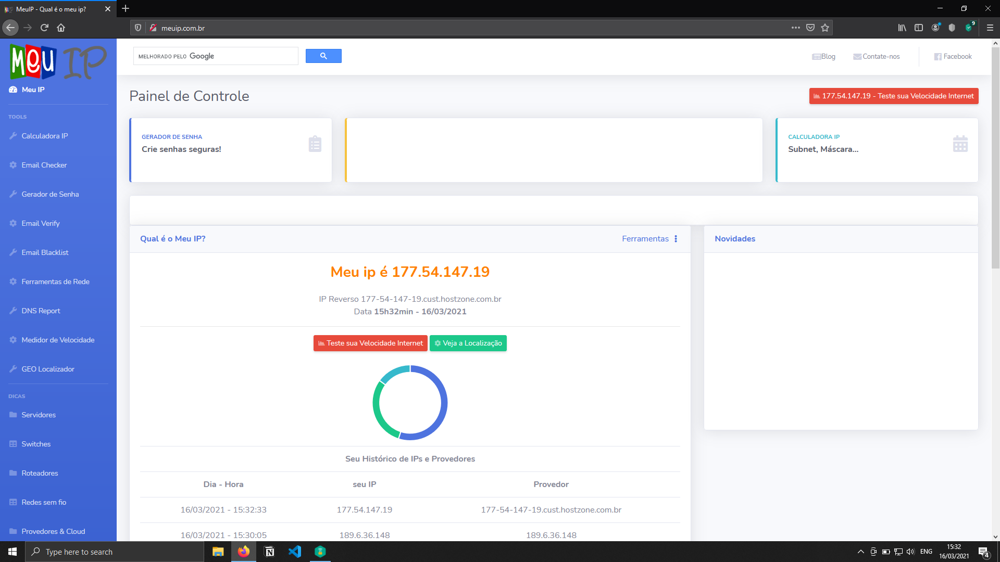

#### 20. Explique com suas palavras porque o Acordo de Nível de Serviço (SLA) é importante quando se contrata um link de internet, por exemplo.

Está relacionado com a garantia de prestação de serviços e aos níveis de qualidade que devem ser atendidos. É uma garantia para o usuário, empresa e o profissional que presta o serviço de TI, caso haja descumprimento do acordo o contratante ou empresa estarão resguardados, na questão financeira, porém não se faz desnecessário a busca de empresas que prestem serviços de qualidade.
